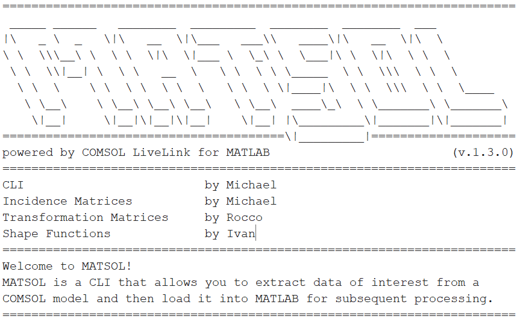

# ITA

## MATSOL

Repository del progetto di Modelli Numerici per Campi e Circuiti, edizione 2023-2024, Università degli Studi della Basilicata, laurea magistrale in Ingegneria informatica e delle tecnologie dell'informazione.

MATSOL è una CLI che permette di estrarre dati di interesse da un modello COMSOL per poi caricarli in MATLAB per successive elaborazioni.

# ENG

## MATSOL

Repository of the Numerical Models for Fields and Circuits project, 2023-2024 edition, University of Basilicata, master's degree in Computer Engineering and Information Technologies.

MATSOL is a CLI that allows you to extract data of interest from a COMSOL model and then load it into MATLAB for subsequent processing.

## Licenza

[MIT](https://choosealicense.com/licenses/mit/)
